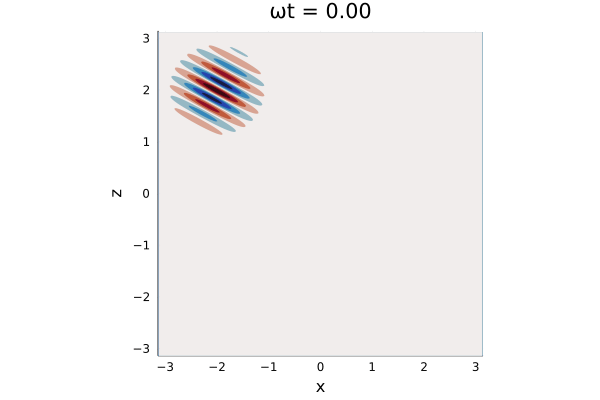

# InternalWaveDemo

Demonstration of internal wave phase/group speeds.

Animation shows an internal wave evolving on a linear background stratification (constant Brunt-Väisälä frequency).

Run Jupyter notebook [`internal_wave.ipynb`](https://nbviewer.jupyter.org/github/ClimateFluidPhysics-ANU/InternalWaveDemo/blob/main/internal_wave.ipynb). The notebook runs on Julia v1.6 and uses [Oceananigans.jl](https://github.com/CliMA/Oceananigans.jl) v0.62.0.

